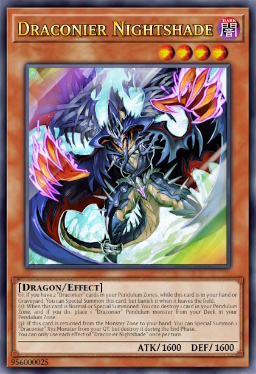
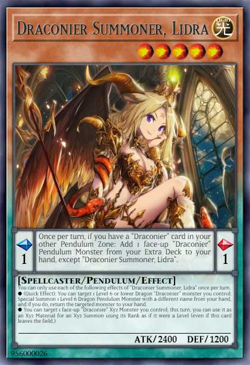

# Edopro Custom Cards by Reflexxion

Welcome to my Edopro Custom Card repository. My idea is to create new archetypes with mechanics that are new or rarely used in the current format.

(I do not own all the artworks of the cards.)

## Wiki

Wiki: https://github.com/lakevin/EdoProCustom/wiki

## Details

### Completed Archetypes

1. Grimm Chain | 26 cards | Support planned
2. Protectrix | 25 cards | Finished!
3. Draconier | 24 cards | Support planned
4. Cosmoverse | 14/14 cards | Finished!

### Planned Archetypes

1. Holy Grail
2. Kniguards
3. Warflame
4. Shadowblades

## Planned Updates

### June 2023

#### Draconier Nightshade

① If you have 2 "Draconier" cards in your Pendulum Zones, while this card is in your hand or Graveyard: You can Special Summon this card, but banish it when it leaves the field.
② If this card is Normal or Special Summoned: You can destroy 1 card in your Pendulum Zone, and if you do, place 1 "Draconier" Pendulum monster in your Pendulum Zone.
③ (Quick Effect): You can Tribute this card; Special Summon 1 "Draconier" monster from your Extra Deck to the Extra Monster Zone, but destroy it during the End Phase.
You can only use each effect of "Draconier Nightshade" once per turn.

#### Draconier Summoner's Element-Change-Magic

Discard 1 Pendulum monster from your hand, then target 1 "Draconier" Xyz monster you control; Special Summon 1 "Draconier" Xyz monster with the same rank, but a different attribute from your Extra Deck, and if you do, shuffle the targeted monster into the Deck. (This Special Summon is treated as an Xyz Summon. Xyz Materials attached to that target also become Xyz Materials on the Summoned monster.)
You can only activate 1 "Draconier Summoner's Element-Change-Magic" per turn.

### Late August / Early September 2023

- New archetype "Holy Grail"
- New archetype "Kniguards"
- New archetype "Warflame"
- New archetype "Shadowblades"
