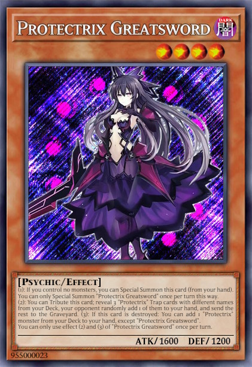
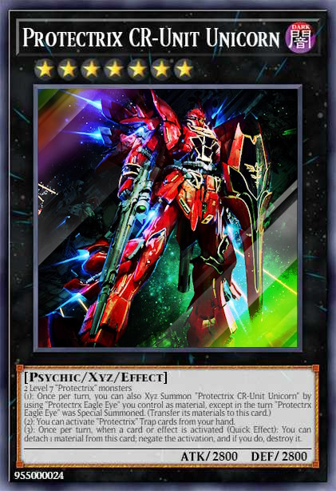

# Edopro Custom Cards by Reflexxion

Welcome to my Edopro Custom Card repository. My idea is to create new archetypes with mechanics that are new or rarely used in the current format.

(I do not own all the artworks of the cards.)

## Wiki

Wiki: https://github.com/lakevin/EdoProCustom/wiki

## Details

### Completed Archetypes

1. Grimm Chain | 26 cards | Finished. (Support planned)
2. Protectrix | 22 cards | Finished. (Support planned)
3. Draconier | 24 cards | Finished. (Support planned)
4. Cosmoverse | 14/14 cards | Finished.

### Planned Archetypes

1. Holy Grail
2. Kniguards
3. Warflame
4. ???

## Planned Updates

### June 2023

#### Protectrix Greatsword 

① If you control no other monsters, you can Special Summon this card from your hand.
② (Quick Effect) You can Tribute this card; reveal 3 "Protectrix" Trap cards with different names from your Deck, your opponent randomly picks 1 for you to Special Summon to your field, and you send the rest to the Graveyard.
③ If this card is destroyed: Add 1 "Protectrix" monster from your Deck to your hand.

#### Protectrix CR-Unit Unicorn

2 Level 7 "Protectrix" monsters 
Once per turn, you can also Xyz Summon "Protectrix CR-Unit Unicorn" by using "Protectrx Eagle Eye" you control as material, except in the turn "Protectrx Eagle Eye" was Special Summoned. (Transfer its materials to this card.)
① You can activate "Protectrix" Trap cards from your hand.
② Once per turn, when a card or effect is activated (Quick Effect): You can detach 1 material from this card; negate the activation, and if you do, destroy it.

#### Protectrix Stellaria 

3 "Protectrix" monster, including 1 Xyz monster 
Must be Fusion Summoned. The Fusion Summon of this card cannot be negated. Cannot be targeted or destroyed by your opponent's card effects.
When a Trap Card is activated (Quick Effect): You can activate 1 of these effects (but you can only use each effect of "Protectrix Stellaria" once per turn). 
● Destroy 1 card on the field. 
● Special Summon 1 Level 4 or lower "Protectrix" monster from your GY. 
● Send 1 "Protectrix" Trap from your Deck to your GY.
