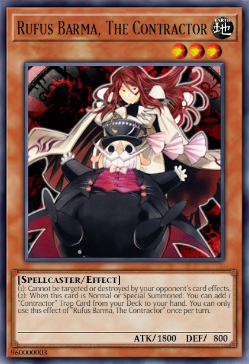
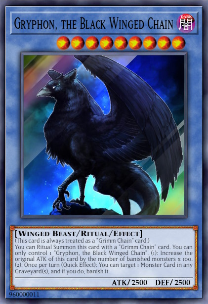
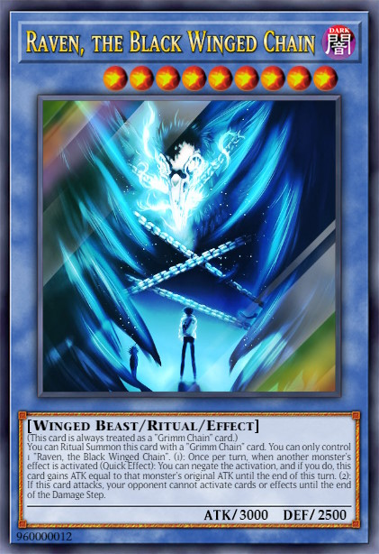
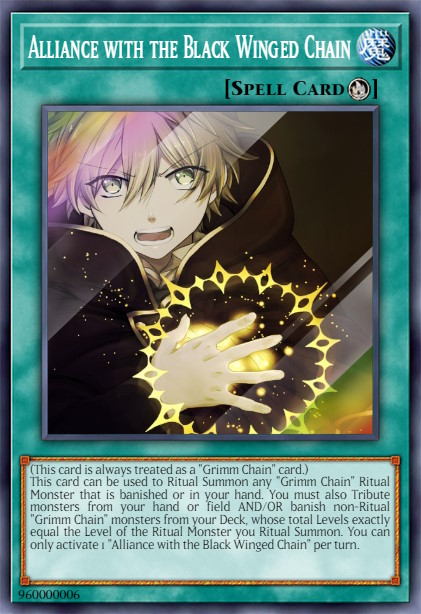
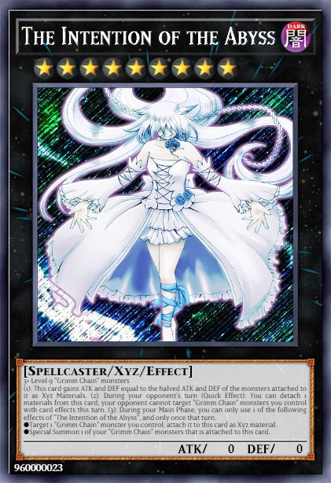

# Grimm Chain

## Table of Contents  
1. [Description](#description)
2. [Cards](#cards)
3. [Combos](#combos)
4. [Example Decks](#example-decks)

 

## Description
The **Grimm Chain** archetype focuses mainly on Ritual Summons. All Main Deck **Grimm Chain** monsters have a trigger effect when they are banished (some effects only trigger when banished from your deck). The **Grimm Chain** monsters are played along with the **Contractor** cards, which are the searchers for both, the **Grimm Chain** and **Contractor** cards. In summary, the **Grimm Chain** archetype is a explosive OTK deck and/or control deck.

 

## Cards
### **Core Monsters**

    
Show / Hide

    <table>
        <tr>
            <th width=200px>Card name</th>
            <th width=120px>Image</th>
            <th>Usage</th>
            <th align="center">Amount</th>
        </tr>
        <tr>
            <td>Oz Vessalius, the Contractor</td>
            <td></td>
            <td>
                It's the <b>one card combo</b> of the deck. When <b>[Summoned]</b> its milling <b>Protectrix</b> Trap Cards. When <b>[Destroyed]</b> its Special Summon 1 Level 4 <b>Protectrix</b> monster from Deck.
            </td>
            <td align="center">3x</td>
        </tr>
        <tr>
            <td>Gilbert Nightray, the Contractor</td>
            <td></td>
            <td>
                This card is an extender and can <b>[Special Summon]</b> itself by banishing 1 <b>Protectrix</b> Trap card from GY. When <b>[Destroyed]</b>: add to hand 1 "Protectrix" monster from the GY.
            </td>
            <td align="center">2-3x</td>
        </tr>
        <tr>
            <td>Rufus Barma, the Contractor</td>
            <td></td>
            <td>
                This card is an extender and can <b>[Special Summon]</b> itself by banishing 1 <b>Protectrix</b> Trap card from GY. Also this card can destroy 1 face-up card you control to <b>[Search]</b> and Set a <b>Protectrix</b> Trap card from your deck. This effect is important to trigger <b>[Destroyed]</b> effects.</li>
            </td>
            <td align="center">1-2x</td>
        </tr>
        <tr>
            <td>Xerxes Break, the Contractor</td>
            <td></td>
            <td>
                This card is an extender: It can be <b>[Special Summon]</b> (from hand) by banishing 2 <b>Protectrix</b> Trap card from GY. This card can banish monster cards with interuption or negation effects temporary. Also it can attack directly, but the damage is halved. Hard to summon so 1-2 copies are fine.
            </td>
            <td align="center">3x</td>
        </tr>
        <tr>
            <td>Glen Baskerville, the Contractor</td>
            <td></td>
            <td>
                This card can also <b>[Special Summon]</b> itself by banishing 1 <b>Protectrix</b> Trap card from GY. One of the key cards in this deck, which can revive Level 4 or lower <b>Protectrix</b> Monster cards from the GY. The downside of this card is, that it locks you to Special Summon only <b>Protectrix</b> monsters for the rest of this turn. So be careful, when playing other archetypes with it.
            </td>
            <td align="center">2-3x</td>
        </tr>
        <tr>
            <td>Gryphon, the Black Winged Chain</td>
            <td></td>
            <td></td>
            <td align="center">1x</td>
        </tr>
        <tr>
            <td>Raven, the Black Winged Chain</td>
            <td></td>
            <td> </td>
            <td align="center">1x</td>
        </tr>
        <tr>
            <td>Dodo, the Black Winged Chain</td>
            <td></td>
            <td> </td>
            <td align="center">1x</td>
        </tr>
        <tr>
            <td>Jabberwock, the Black Winged Chain</td>
            <td></td>
            <td></td>
            <td align="center">1x</td>
        </tr>
        <tr>
            <td>Owl, the Black Winged Chain</td>
            <td></td>
            <td></td>
            <td align="center">1x</td>
        </tr>
        <tr>
            <td>Alice, Grimm Chain of the Abyss</td>
            <td></td>
            <td>[Extender] Can Special Summon itself, if you control a <b>Contractor</b> monster.</td>
            <td align="center">2-3x</td>
        </tr>
        <tr>
            <td>Cheshire, Grimm Chain of the Abyss</td>
            <td></td>
            <td>[Extender] Can Special Summon itself, if it is banished from your deck. Can be achieved by Ritual Spell cards.</td>
            <td align="center">2x</td>
        </tr>
        <tr>
            <td>Eques, Grimm Chain of the Abyss</td>
            <td></td>
            <td>[Milling] When summoned, you can banish <b>Grimm Chain</b> monsters from your deck. [Special Summon] When banished it can Special Summon <b>Contractor</b> monster.</td>
            <td align="center">2-3x</td>
        </tr>
        <tr>
            <td>Leon, Grimm Chain of the Abyss</td>
            <td></td>
            <td>[Destroy] When banished non-target destruction.</td>
            <td align="center">1-2x</td>
        </tr>
    </table>

 

### **Core Spells**

    
Show / Hide

    <table>
        <tr>
            <th width=200px>Card name</th>
            <th width=120px>Image</th>
            <th>Usage</th>
            <th align="center">Amount</th>
        </tr>
        <tr>
            <td>Alliance with the Black Winged Chain</td>
            <td></td>
            <td></td>
            <td align="center">3x</td>
        </tr>
        <tr>
            <td>Abyss of Grimm Chains</td>
            <td></td>
            <td></td>
            <td align="center">3x</td>
        </tr>
        <tr>
            <td>Pact with the Black Winged Chain</td>
            <td></td>
            <td></td>
            <td align="center">2x</td>
        </tr>
        <tr>
            <td>Contractor's Pandora</td>
            <td></td>
            <td></td>
            <td align="center">3x</td>
        </tr>
    </table>

 

### **Core Traps**

    
Show / Hide

    <table>
        <tr>
            <th width=200px>Card name</th>
            <th width=120px>Image</th>
            <th>Usage</th>
            <th align="center">Amount</th>
        </tr>
        <tr>
            <td>Contractor Counter</td>
            <td></td>
            <td></td>
            <td align="center">0-1x</td>
        </tr>
        <tr>
            <td>Contractor Protection</td>
            <td></td>
            <td></td>
            <td align="center">2-3x</td>
        </tr>
    </table>

 

### **Extra Deck**

    
Show / Hide

    <table>
        <tr>
            <th width=200px>Card name</th>
            <th width=120px>Image</th>
            <th>Usage</th>
            <th align="center">Amount</th>
        </tr>
        <tr>
            <td>Doldum, Grimm Chain of the Abyss</td>
            <td></td>
            <td></td>
            <td align="center">1-2x</td>
        </tr>
        <tr>
            <td>Bloody Rabbit, Grimm Chain of the Abyss</td>
            <td></td>
            <td></td>
            <td align="center">1-2x</td>
        </tr>
        <tr>
            <td>Mad Hatter, Grimm Chain of the Abyss</td>
            <td></td>
            <td></td>
            <td align="center">2-3x</td>
        </tr>
        <tr>
            <td>The Will of the Abyss</td>
            <td></td>
            <td></td>
            <td align="center">1x</td>
        </tr>
        <tr>
            <td>Headhunter, Grimm Chain of the Abyss</td>
            <td></td>
            <td></td>
            <td align="center">1-2x</td>
        </tr>
    </table>

 

### **Extentions**

    
Show / Hide

    <table>
        <tr>
            <th width=200px>Card name</th>
            <th width=120px>Image</th>
            <th>Usage</th>
            <th align="center">Amount</th>
        </tr>
        <tr>
            <td>Gold Sarcophagus</td>
            <td></td>
            <td>
                Helps to trigger the effects of "Grimm Chain" monsters when they get banished.
            </td>
            <td align="center">1x (limited)</td>
        </tr>
        <tr>
            <td>Manju of the Ten Thousand Hands</td>
            <td></td>
            <td>
                Can increase the consistency of searching Ritual Spells or Monsters, but cannot be used to Special Summon "Grimm Chain" Extra Deck monsters.
            </td>
            <td align="center">0-3x (Optional)</td>
        </tr>
        <tr>
            <td>Dimensional Fissure</td>
            <td></td>
            <td>
                Helps along the "Grimm Chain" Field Spell to banish many cards. Floodgate for deck's which banishing weakness.
            </td>
            <td align="center">0-3x (Optional)</td>
        </tr>
        <tr>
            <td>Leviair the Sea Dragon</td>
            <td></td>
            <td>
                Special Summons banished monsters.
            </td>
            <td align="center">1x (Optional)</td>
        </tr>
    </table>

 

## Combos

    
Going First #1

    <table>
        <tr>
            <td valign="center">
                <h3>Opening Hand</h3>
            </td>
            <td align="center">
                
            </td>
            <td align="center">
                +
            </td>
            <td align="center">
                
            </td>
            <td colspan="6"></td>
        </tr>
        <tr>
            <td><h3>Step 1</h3></td>
            <td align="center">
                 
                Activate
            </td>
            <td align="center">
                =>
            </td>
            <td align="center">
                 
                Special
            </td>
            <td align="center">
                +
            </td>
            <td align="center">
                 
                Special
            </td>
            <td colspan="4"></td>
        </tr>
        <tr>
            <td><h3>Step 2</h3></td>
            <td align="center">
                 
                Activate
            </td>
            <td align="center">
                =>
            </td>
            <td align="center">
                 
                Search
            </td>
            <td align="center">
                +
            </td>
            <td align="center">
                 
                Activate
            </td>
            <td align="center">
                =>
            </td>
            <td align="center">
                 
                Search
            </td>
            <td colspan="2"></td>
        </tr>
        <tr>
            <td><h3>Step 3</h3></td>
            <td align="center">
                 
                Activate
            </td>
            <td align="center">
                =>
            </td>
            <td align="center">
                 
                Banish
            </td>
            <td align="center">
                +
            </td>
            <td align="center">
                 
                Banish
            </td>
            <td align="center">
                +
            </td>
            <td align="center">
                 
                Banish
            </td>
            <td align="center">
                =>
            </td>
            <td align="center">
                 
                Special
            </td>
        </tr>
        <tr>
            <td><h3>Step 4</h3></td>
            <td align="center">
                 
                Activate
            </td>
            <td align="center">
                =>
            </td>
            <td align="center">
                 
                Search
            </td>
            <td align="center">
                +
            </td>
            <td align="center">
                 
                Activate
            </td>
            <td align="center">
                =>
            </td>
            <td align="center">
                 
                Special
            </td>
            <td colspan="2">&nbsp;</td>
        </tr>
        <tr>
            <td>&nbsp;</td>
            <td align="center">
                 
                Activate
            </td>
            <td align="center">
                =>
            </td>
            <td align="center">
                 
                Banish
            </td>
            <td colspan="4">&nbsp;</td>
        </tr>
        <tr>
            <td><h3>Current Board</h3></td>
            <td align="center">
                
            </td>
            <td align="center">
                +
            </td>
            <td align="center">
                
            </td>
            <td align="center">
                +
            </td>
            <td align="center">
                
            </td>
            <td align="center">
                +
            </td>
            <td align="center">
                
            </td>
            <td colspan="2">&nbsp;</td>
        </tr>
        <tr>
            <td><h3>Step 5</h3></td>
            <td align="center">
                 
                Activate
            </td>
            <td align="center">
                =>
            </td>
            <td align="center">
                 
                Special
            </td>
            <td colspan="6">&nbsp;</td>
        </tr>
        <tr>
            <td><h3>Step 6</h3></td>
            <td align="center">
                 
                Activate
            </td>
            <td align="center">
                =>
            </td>
            <td align="center">
                 
                Discard
            </td>
            <td align="center">
                =>
            </td>
            <td align="center">
                 
                Special
            </td>
            <td colspan="4">&nbsp;</td>
        </tr>
        <tr>
            <td><h3>Step 7</h3></td>
            <td align="center">
                 
                Synchro
            </td>
            <td align="center">
                +
            </td>
            <td align="center">
                 
                Synchro
            </td>
            <td align="center">
                +
            </td>
            <td align="center">
                 
                Synchro
            </td>
            <td align="center">
                +
            </td>
            <td align="center">
                 
                Special
            </td>
            <td colspan="2">&nbsp;</td>
        </tr>
        <tr>
            <td><h3>Step 8</h3></td>
            <td align="center">
                 
                Overlay
            </td>
            <td align="center">
                +
            </td>
            <td align="center">
                 
                Overlay
            </td>
            <td align="center">
                =>
            </td>
            <td align="center">
                 
                Special
            </td>
            <td colspan="4">&nbsp;</td>
        </tr>
        <tr>
            <td><h3>End Board</h3></td>
            <td align="center">
                 
                Negate
            </td>
            <td align="center">
                +
            </td>
            <td align="center">
                 
                Negate
            </td>
            <td align="center">
                +
            </td>
            <td align="center">
                 
                Floodgate
            </td>
            <td align="center">
                +
            </td>
            <td align="center">
                 
                Defense
            </td>
            <td colspan="2">&nbsp;</td>
        </tr>
    </table>

 

## Example Decks
