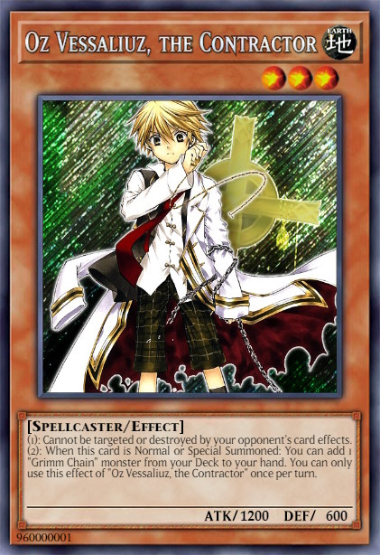
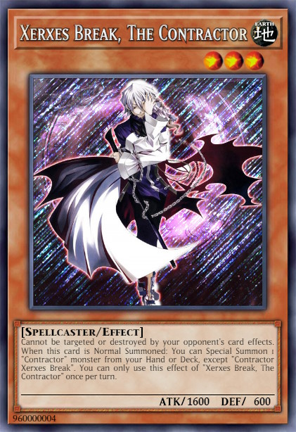
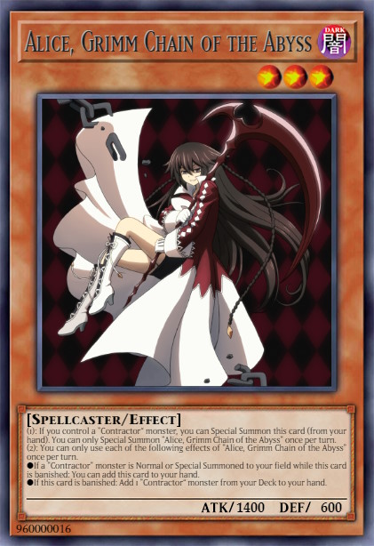
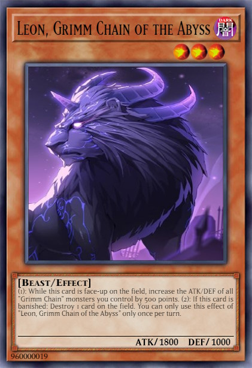
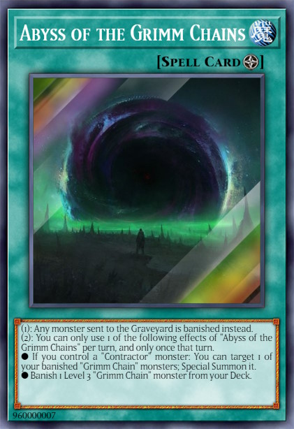
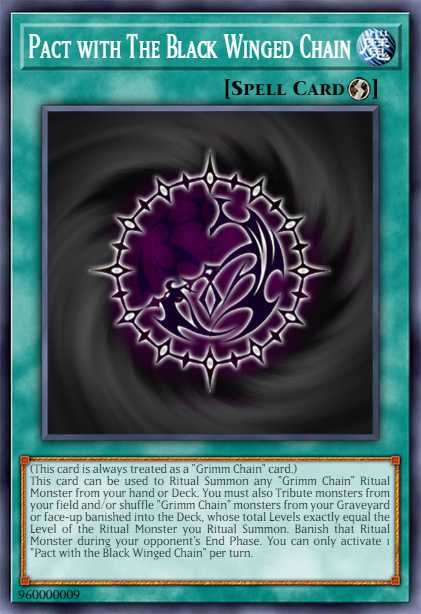
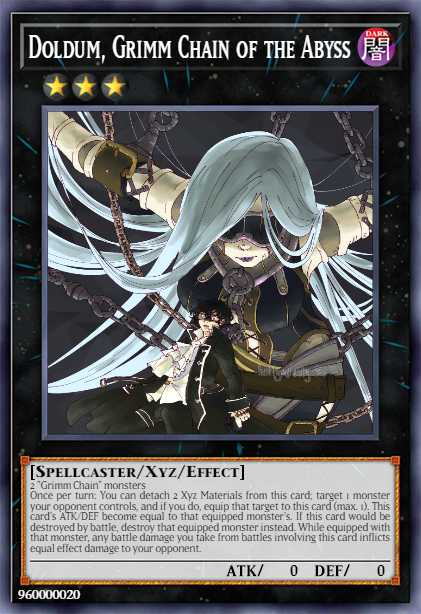
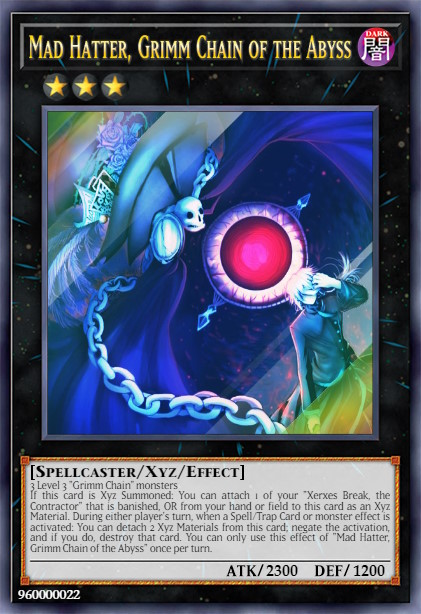
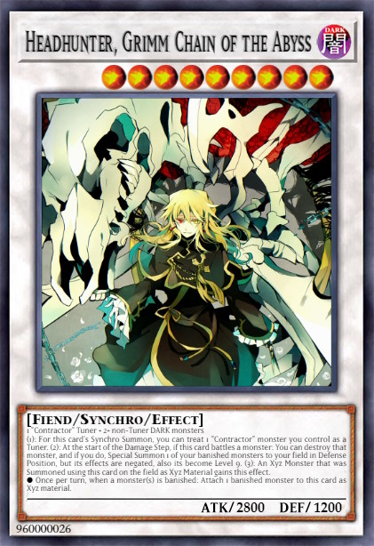

# Grimm Chain

## Table of Contents  
1. [Description](#description)
2. [Cards](#cards)
3. [Combos](#combos)
4. [Example Decks](#example-decks)

 

## Description
The **Grimm Chain** archetype focuses mainly on Ritual Summons. All Main Deck **Grimm Chain** monsters have a trigger effect when they are banished (some effects only trigger when banished from your deck). The **Grimm Chain** monsters are played along with the **Contractor** cards, which are the searchers for both, the **Grimm Chain** and **Contractor** cards. In summary, the **Grimm Chain** archetype is a explosive OTK deck and/or control deck.

 

## Cards
### **Core Monsters**

    
Show / Hide

    <table>
        <tr>
            <th width=200px>Card name</th>
            <th width=120px>Image</th>
            <th>Usage</th>
            <th align="center">Amount</th>
        </tr>
        <tr>
            <td>Oz Vessalius, the Contractor</td>
            <td></td>
            <td>
                [Searcher] <b>Grimm Chain</b> monsters (also the Ritual monsters)
            </td>
            <td align="center">3x</td>
        </tr>
        <tr>
            <td>Gilbert Nightray, the Contractor</td>
            <td></td>
            <td>
                [Searcher] <b>Grimm Chain</b> or <b>Contractor</b> Spell Cards.
            </td>
            <td align="center">2-3x</td>
        </tr>
        <tr>
            <td>Rufus Barma, the Contractor</td>
            <td></td>
            <td>
                [Searcher] <b>Grimm Chain</b> or <b>Contractor</b> Trap Cards. 
            </td>
            <td align="center">1-2x</td>
        </tr>
        <tr>
            <td>Xerxes Break, the Contractor</td>
            <td></td>
            <td>
                [Extender] Special Summons 1 <b>Contractor</b> monster from your deck.
            </td>
            <td align="center">3x</td>
        </tr>
        <tr>
            <td>Glen Baskerville, the Contractor</td>
            <td></td>
            <td>
                This card is primarly used as whole material for Ritual Summons. And if it is used you can banish 1 <b>Contractor</b> monster from your deck. The banished card is a traget for "Eques, Grimm Chain of the Abyss".
            </td>
            <td align="center">2-3x</td>
        </tr>
        <tr>
            <td>Gryphon, the Black Winged Chain</td>
            <td></td>
            <td>
                This card is a resource remover, which can [Banish] 1 monster in any Graveyards.
            </td>
            <td align="center">1x</td>
        </tr>
        <tr>
            <td>Raven, the Black Winged Chain</td>
            <td></td>
            <td>
                This card is a once per turn [Monster Negate] which also increase its ATK with this effect.
            </td>
            <td align="center">1x</td>
        </tr>
        <tr>
            <td>Dodo, the Black Winged Chain</td>
            <td></td>
            <td>
                This card generates [Tokens] which can be used for link summons. Moreover it can [Stall] your opponent with its protection effect, while you control a Token.
            </td>
            <td align="center">1x</td>
        </tr>
        <tr>
            <td>Jabberwock, the Black Winged Chain</td>
            <td></td>
            <td>
                Multi [Destroyer] for all cards in this card's column that your opponent controls.
            </td>
            <td align="center">1x</td>
        </tr>
        <tr>
            <td>Owl, the Black Winged Chain</td>
            <td></td>
            <td>
                This card functions as an additional Ritual Spell card.
            </td>
            <td align="center">1x</td>
        </tr>
        <tr>
            <td>Alice, Grimm Chain of the Abyss</td>
            <td></td>
            <td>[Extender] Can Special Summon itself, if you control a <b>Contractor</b> monster.</td>
            <td align="center">2-3x</td>
        </tr>
        <tr>
            <td>Cheshire, Grimm Chain of the Abyss</td>
            <td></td>
            <td>[Extender] Can Special Summon itself, if it is banished from your deck. Can be achieved by Ritual Spell cards.</td>
            <td align="center">2x</td>
        </tr>
        <tr>
            <td>Eques, Grimm Chain of the Abyss</td>
            <td></td>
            <td>[Milling] When summoned, you can banish <b>Grimm Chain</b> monsters from your deck. [Special Summon] When banished it can Special Summon <b>Contractor</b> monster.</td>
            <td align="center">2-3x</td>
        </tr>
        <tr>
            <td>Leon, Grimm Chain of the Abyss</td>
            <td></td>
            <td>[Destroy] When banished non-target destruction.</td>
            <td align="center">1-2x</td>
        </tr>
    </table>

 

### **Core Spells**

    
Show / Hide

    <table>
        <tr>
            <th width=200px>Card name</th>
            <th width=120px>Image</th>
            <th>Usage</th>
            <th align="center">Amount</th>
        </tr>
        <tr>
            <td>Alliance with the Black Winged Chain</td>
            <td></td>
            <td>
                Ritual Spell card for <b>Grimm Chain</b> Ritual monsters. [Special Summons] banished monsters or from your hand. [Materials] can be used from your field, hand or banished from your deck.
            </td>
            <td align="center">3x</td>
        </tr>
        <tr>
            <td>Abyss of Grimm Chains</td>
            <td></td>
            <td>
                Field Spell that [Banish] all monsters instead of sending them to the GY. It helps to trigger the effects of your monsters when banished and is also a Floodgate.
            </td>
            <td align="center">3x</td>
        </tr>
        <tr>
            <td>Pact with the Black Winged Chain</td>
            <td></td>
            <td>
                Ritual Spell card for <b>Grimm Chain</b> Ritual monsters. [Special Summons] from your hand or deck (but only temporary). [Materials] can be used from your field or banished cards by shuffeling back into deck.
            </td>
            <td align="center">2x</td>
        </tr>
        <tr>
            <td>Contractor's Pandora</td>
            <td></td>
            <td>
                This card is increase the consistency of Summoning Ritual Monsters. This allows an one card combo which ends with "The Intention of the Abyss" on the board. Best targets are "Oz Vessalius, the Contractor" and "Gilbert Nightray, the Contractor" to be Special Summones by this card.
            </td>
            <td align="center">3x</td>
        </tr>
    </table>

 

### **Core Traps**

    
Show / Hide

    <table>
        <tr>
            <th width=200px>Card name</th>
            <th width=120px>Image</th>
            <th>Usage</th>
            <th align="center">Amount</th>
        </tr>
        <tr>
            <td>Contractor Counter</td>
            <td></td>
            <td>
                All <b>Contractor</b> monster have its own protection do effect. To also protect your <b>Grimm Chain</b> monsters from targeting or destruction this card can be useful.
            </td>
            <td align="center">0-1x</td>
        </tr>
        <tr>
            <td>Contractor Protection</td>
            <td></td>
            <td>
                This Trap card is an [Omni Negate] which can only be used, when you control a <b>Contractor</b> and <b>Grimm Chain</b> monster.
            </td>
            <td align="center">2-3x</td>
        </tr>
    </table>

 

### **Extra Deck**

    
Show / Hide

    <table>
        <tr>
            <th width=200px>Card name</th>
            <th width=120px>Image</th>
            <th>Usage</th>
            <th align="center">Amount</th>
        </tr>
        <tr>
            <td>Doldum, Grimm Chain of the Abyss</td>
            <td></td>
            <td>
                2 "Grimm Chain" monsters 
                This card can equip at maximum 1 monster card your opponent controls to itself. An option to get rid of annoying monsters.
            </td>
            <td align="center">1-2x</td>
        </tr>
        <tr>
            <td>Bloody Rabbit, Grimm Chain of the Abyss</td>
            <td></td>
            <td>
                2 Level 3 Spellcaster-type monsters 
                [Banishes] 1 monster card your opponent controls. Helps against destruction protection effects.
            </td>
            <td align="center">1-2x</td>
        </tr>
        <tr>
            <td>Mad Hatter, Grimm Chain of the Abyss</td>
            <td></td>
            <td>
                3 Level 3 "Grimm Chain" monsters 
                Powerful [Omni Negate] card. Can be summoned by the "Eques, Grimm Chain of the Abyss" combo.
            </td>
            <td align="center">2-3x</td>
        </tr>
        <tr>
            <td>The Intention of the Abyss</td>
            <td></td>
            <td>
                2 or more Level 9 "Grimm Chain" monsters 
                An ultimative boss monster, which can banish monster from your opponents Extra Deck to take away the opponent's options. Each time a card is banished the power of this card can be increased. But if this card hast do many materials it wipes the board.
            </td>
            <td align="center">1x</td>
        </tr>
        <tr>
            <td>Headhunter, Grimm Chain of the Abyss</td>
            <td></td>
            <td>
                1 "Contractor" Tuner + 2 DARK monsters 
                This card can [Destroy] monsters during Damage Step and [Special Summons] monsters banished monsters and change its Level to 9. Which helps to Summon "The Intention of the Abyss". A Xyz monster which uses this card as material obtain the effect to negates all effects of Special Summoned monsters, except they were banished before.
            </td>
            <td align="center">1-2x</td>
        </tr>
    </table>

 

### **Extentions**

    
Show / Hide

    <table>
        <tr>
            <th width=200px>Card name</th>
            <th width=120px>Image</th>
            <th>Usage</th>
            <th align="center">Amount</th>
        </tr>
        <tr>
            <td>Gold Sarcophagus</td>
            <td></td>
            <td>
                Helps to trigger the effects of "Grimm Chain" monsters when they get banished.
            </td>
            <td align="center">1x (limited)</td>
        </tr>
        <tr>
            <td>Manju of the Ten Thousand Hands</td>
            <td></td>
            <td>
                Can increase the consistency of searching Ritual Spells or Monsters, but cannot be used to Special Summon "Grimm Chain" Extra Deck monsters.
            </td>
            <td align="center">0-3x (Optional)</td>
        </tr>
        <tr>
            <td>Dimensional Fissure</td>
            <td></td>
            <td>
                Helps along the "Grimm Chain" Field Spell to banish many cards. Floodgate for deck's which banishing weakness.
            </td>
            <td align="center">0-3x (Optional)</td>
        </tr>
        <tr>
            <td>Leviair the Sea Dragon</td>
            <td></td>
            <td>
                Special Summons banished monsters.
            </td>
            <td align="center">1x (Optional)</td>
        </tr>
    </table>

 

## Combos

    
Combo #1

    <table>
        <tr>
            <td valign="center">
                <h3>Opening Hand</h3>
            </td>
            <td align="center">
                
            </td>
            <td align="center">
                +
            </td>
            <td align="center">
                
            </td>
            <td colspan="6"></td>
        </tr>
        <tr>
            <td><h3>Step 1</h3></td>
            <td align="center">
                 
                Activate
            </td>
            <td align="center">
                =>
            </td>
            <td align="center">
                 
                Special
            </td>
            <td align="center">
                +
            </td>
            <td align="center">
                 
                Special
            </td>
            <td colspan="4"></td>
        </tr>
        <tr>
            <td><h3>Step 2</h3></td>
            <td align="center">
                 
                Activate
            </td>
            <td align="center">
                =>
            </td>
            <td align="center">
                 
                Search
            </td>
            <td align="center">
                +
            </td>
            <td align="center">
                 
                Activate
            </td>
            <td align="center">
                =>
            </td>
            <td align="center">
                 
                Search
            </td>
            <td colspan="2">&nbsp;</td>
        </tr>
        <tr>
            <td><h3>Step 3</h3></td>
            <td align="center">
                 
                Activate
            </td>
            <td align="center">
                =>
            </td>
            <td align="center">
                 
                Banish
            </td>
            <td align="center">
                +
            </td>
            <td align="center">
                 
                Banish
            </td>
            <td align="center">
                +
            </td>
            <td align="center">
                 
                Banish
            </td>
            <td align="center">
                =>
            </td>
            <td align="center">
                 
                Special
            </td>
        </tr>
        <tr>
            <td><h3>Step 4</h3></td>
            <td align="center">
                 
                Activate
            </td>
            <td align="center">
                =>
            </td>
            <td align="center">
                 
                Search
            </td>
            <td align="center">
                +
            </td>
            <td align="center">
                 
                Activate
            </td>
            <td align="center">
                =>
            </td>
            <td align="center">
                 
                Special
            </td>
            <td colspan="2">&nbsp;</td>
        </tr>
        <tr>
            <td>&nbsp;</td>
            <td align="center">
                 
                Activate
            </td>
            <td align="center">
                =>
            </td>
            <td align="center">
                 
                Banish
            </td>
            <td colspan="4">&nbsp;</td>
        </tr>
        <tr>
            <td><h3>Current Board</h3></td>
            <td align="center">
                
            </td>
            <td align="center">
                +
            </td>
            <td align="center">
                
            </td>
            <td align="center">
                +
            </td>
            <td align="center">
                
            </td>
            <td align="center">
                +
            </td>
            <td align="center">
                
            </td>
            <td colspan="2">&nbsp;</td>
        </tr>
        <tr>
            <td><h3>Step 5</h3></td>
            <td align="center">
                 
                Activate
            </td>
            <td align="center">
                =>
            </td>
            <td align="center">
                 
                Special
            </td>
            <td colspan="6">&nbsp;</td>
        </tr>
        <tr>
            <td><h3>Step 6</h3></td>
            <td align="center">
                 
                Activate
            </td>
            <td align="center">
                =>
            </td>
            <td align="center">
                 
                Discard
            </td>
            <td align="center">
                =>
            </td>
            <td align="center">
                 
                Special
            </td>
            <td colspan="4">&nbsp;</td>
        </tr>
        <tr>
            <td><h3>Step 7</h3></td>
            <td align="center">
                 
                Synchro
            </td>
            <td align="center">
                +
            </td>
            <td align="center">
                 
                Synchro
            </td>
            <td align="center">
                +
            </td>
            <td align="center">
                 
                Synchro
            </td>
            <td align="center">
                +
            </td>
            <td align="center">
                 
                Special
            </td>
            <td colspan="2">&nbsp;</td>
        </tr>
        <tr>
            <td><h3>Step 8</h3></td>
            <td align="center">
                 
                Overlay
            </td>
            <td align="center">
                +
            </td>
            <td align="center">
                 
                Overlay
            </td>
            <td align="center">
                =>
            </td>
            <td align="center">
                 
                Special
            </td>
            <td colspan="4">&nbsp;</td>
        </tr>
        <tr>
            <td><h3>End Board</h3></td>
            <td align="center">
                 
                Negate
            </td>
            <td align="center">
                +
            </td>
            <td align="center">
                 
                Negate
            </td>
            <td align="center">
                +
            </td>
            <td align="center">
                 
                Floodgate
            </td>
            <td colspan="4">&nbsp;</td>
        </tr>
    </table>

 

    
Combo #2

    <table>
        <tr>
            <td valign="center">
                <h3>Opening hand (Option A)</h3>
            </td>
            <td align="center">
                
            </td>
            <td align="center">
                +
            </td>
            <td align="center">
                
            </td>
            <td colspan="3">&nbsp;</td>
            <td align="center">
                 
                Activate
            </td>
            <td align="center">
                =>
            </td>
            <td align="center">
                 
                Search
            </td>
        </tr>
        <tr>
            <td valign="center">
                <h3>Opening hand (Option B)</h3>
            </td>
            <td align="center">
                
            </td>
            <td align="center">
                +
            </td>
            <td align="center">
                
            </td>
            <td colspan="3">&nbsp;</td>
            <td align="center">
                 
                Activate
            </td>
            <td align="center">
                =>
            </td>
            <td align="center">
                 
                Search
            </td>
        </tr>
        <tr>
            <td><h3>Ritual Summon</h3></td>
            <td align="center">
                 
                Activate
            </td>
            <td align="center">
                =>
            </td>
            <td align="center">
                 
                Banish
            </td>
            <td align="center">
                +
            </td>
            <td align="center">
                 
                Banish
            </td>
            <td align="center">
                +
            </td>
            <td align="center">
                 
                Banish
            </td>
            <td align="center">
                =>
            </td>
            <td align="center">
                 
                Special
            </td>
        </tr>
        <tr>
            <td colspan="10">
                 
                <h3>→ Proceed with Step 4 of Combo #1</h3>
                 
            </td>
        </tr>
    </table>

 

    
Combo #3 - Eques Combo

    <table>
        <tr>
            <td valign="center">
                <h3>Requirements</h3>
            </td>
            <td align="center">
                 
                Banished
            </td>
            <td colspan="8">&nbsp;</td>
        </tr>
        <tr>
            <td valign="center">
                <h3>Opening hand</h3>
            </td>
            <td align="center">
                
            </td>
            <td align="center">
                +
            </td>
            <td align="center">
                
            </td>
            <td align="center">
                +
            </td>
            <td align="center">
                
            </td>
            <td colspan="4">&nbsp;</td>
        </tr>
        <tr>
            <td><h3>Ritual Summon</h3></td>
            <td align="center">
                 
                Activate
            </td>
            <td align="center">
                =>
            </td>
            <td align="center">
                 
                Banish
            </td>
            <td align="center">
                +
            </td>
            <td align="center">
                 
                Banish
            </td>
            <td align="center">
                +
            </td>
            <td align="center">
                 
                Banish
            </td>
            <td align="center">
                =>
            </td>
            <td align="center">
                 
                Special
            </td>
        </tr>
        <tr>
            <td><h3>Trigger Effects</h3></td>
            <td align="center">
                 
                Activate
            </td>
            <td align="center">
                =>
            </td>
            <td align="center">
                 
                Search
            </td>
            <td align="center">&nbsp;</td>
            <td align="center">
                 
                Activate
            </td>
            <td align="center">
                =>
            </td>
            <td align="center">
                 
                Special
            </td>
            <td colspan="2">&nbsp;</td>
        </tr>
        <tr>
            <td>&nbsp;</td>
            <td align="center">
                 
                Activate
            </td>
            <td align="center">
                =>
            </td>
            <td align="center">
                 
                Special
            </td>
            <td align="center">&nbsp;</td>
            <td align="center">
                 
                Activate
            </td>
            <td align="center">
                =>
            </td>
            <td align="center">
                 
                To hand
            </td>
            <td align="center">
                =>
            </td>
            <td align="center">
                 
                Special
            </td>
        </tr>
        <tr>
            <td><h3>Now put all togeteher...</h3></td>
            <td align="center">
                 
                Activate
            </td>
            <td align="center">
                =>
            </td>
            <td align="center">
                 
                Special
            </td>
            <td align="center">=></td>
            <td align="center">
                 
                Banish
            </td>
            <td align="center">=></td>
            <td align="center">
                 
                Destroy
            </td>
            <td colspan="2">&nbsp;</td>
        </tr>
        <tr>
            <td>&nbsp;</td>
            <td align="center">
                 
                Overlay
            </td>
            <td align="center">
                +
            </td>
            <td align="center">
                 
                Overlay
            </td>
            <td align="center">
                +
            </td>
            <td align="center">
                 
                Overlay
            </td>
            <td align="center">
                =>
            </td>
            <td align="center">
                 
                Special
            </td>
            <td colspan="2">&nbsp;</td>
        </tr>
        <tr>
            <td><h3>End Board</h3></td>
            <td align="center">
                 
                Negate
            </td>
            <td align="center">
                +
            </td>
            <td align="center">
                 
                Negate
            </td>
            <td align="center">
                +
            </td>
            <td align="center">
                 
                Floodgate
            </td>
            <td colspan="4">&nbsp;</td>
        </tr>
    </table>

 

## Example Decks
