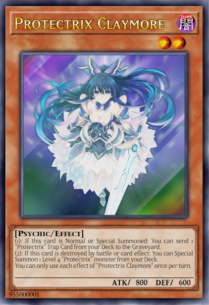
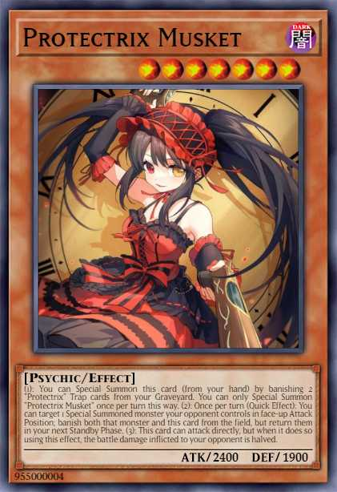
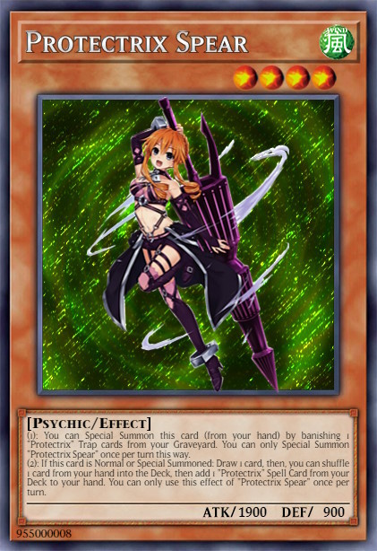
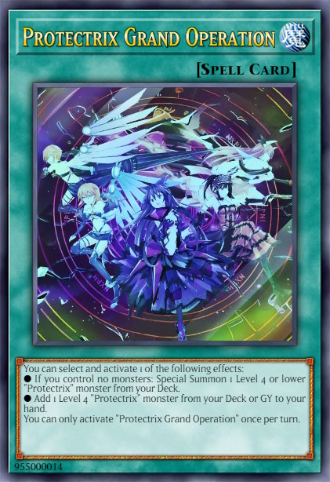
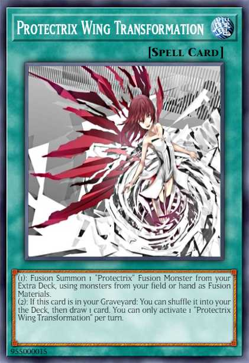
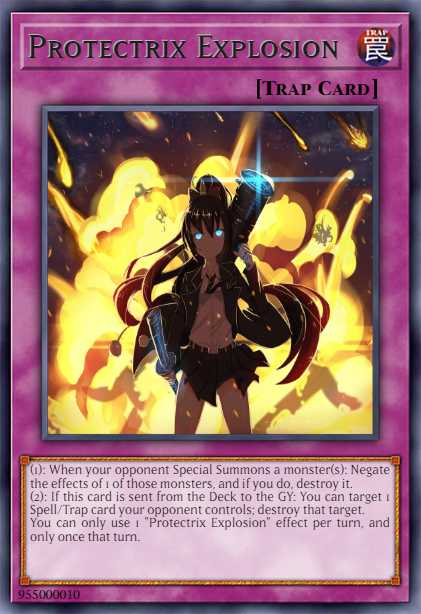
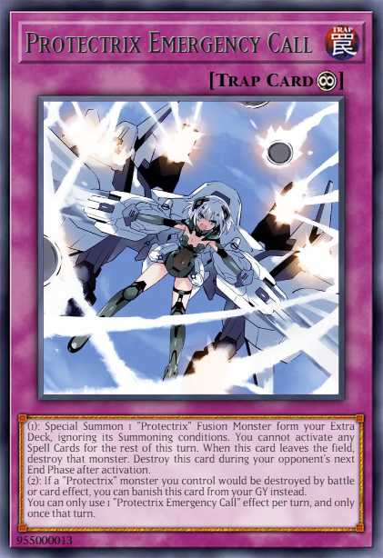
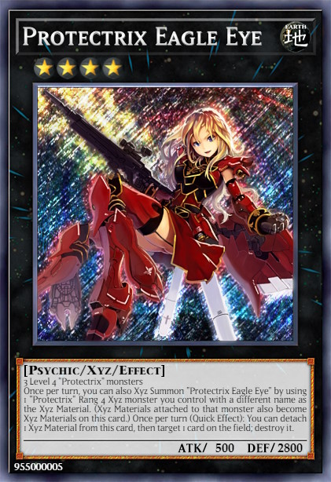
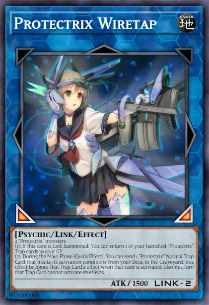
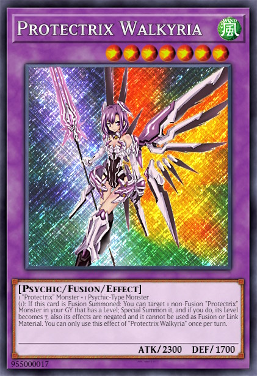

# Protectrix

## Table of Contents  
1. [Description](#description)
2. [Cards](#cards)
3. [Combos](#combos)
4. [Example Decks](#example-decks)

 

## Description
The **Protectrix** archetype is centered on milling Trap Cards from the player's Deck to trigger powerful effects. All Main Deck **Protectrix** monsters can Special Summon itself from the hand, by banishing a number of **Protectrix** Trap Cards from the Graveyard, except "Protectrix Claymore". Moreover most of the **Protectrix** monsters have trigger effects, when they are destroyed. The Extra Deck is focused to perform Fusion and Xyz Summons, but can be extented by Link and Synchro monsters.

 

## Cards
### **Core Monsters**

    
Show / Hide

    <table>
        <tr>
            <th width=200px>Card name</th>
            <th width=120px>Image</th>
            <th>Usage</th>
            <th align="center">Amount</th>
        </tr>
        <tr>
            <td>Protectrix Claymore</td>
            <td></td>
            <td>
                It's the <b>one card combo</b> of the deck. When <b>[Summoned]</b> its milling <b>Protectrix</b> Trap Cards. When <b>[Destroyed]</b> its Special Summon 1 Level 4 <b>Protectrix</b> monster from Deck.
            </td>
            <td align="center">3x</td>
        </tr>
        <tr>
            <td>Protectrix Halberd</td>
            <td></td>
            <td>
                This card is an extender and can <b>[Special Summon]</b> itself by banishing 1 <b>Protectrix</b> Trap card from GY. When <b>[Destroyed]</b>: add to hand 1 "Protectrix" monster from the GY.
            </td>
            <td align="center">0-1x</td>
        </tr>
        <tr>
            <td>Protectrix Pendulum</td>
            <td></td>
            <td>
                This card is an extender and can <b>[Special Summon]</b> itself by banishing 1 <b>Protectrix</b> Trap card from GY. Also this card can destroy 1 face-up card you control to <b>[Search]</b> and Set a <b>Protectrix</b> Trap card from your deck. This effect is important to trigger <b>[Destroyed]</b> effects.</li>
            </td>
            <td align="center">2-3x</td>
        </tr>
        <tr>
            <td>Protectrix Musket</td>
            <td></td>
            <td>
                This card is an extender: It can be <b>[Special Summon]</b> (from hand) by banishing 2 <b>Protectrix</b> Trap card from GY. This card can banish monster cards with interuption or negation effects temporary. Also it can attack directly, but the damage is halved. Hard to summon so 1-2 copies are fine.
            </td>
            <td align="center">1-2x</td>
        </tr>
        <tr>
            <td>Protectrix Sythe</td>
            <td></td>
            <td>
                This card can also <b>[Special Summon]</b> itself by banishing 1 <b>Protectrix</b> Trap card from GY. One of the key cards in this deck, which can revive Level 4 or lower <b>Protectrix</b> Monster cards from the GY. The downside of this card is, that it locks you to Special Summon only <b>Protectrix</b> monsters for the rest of this turn. So be careful, when playing other archetypes with it.
            </td>
            <td align="center">3x</td>
        </tr>
        <tr>
            <td>Protectrix Spear</td>
            <td></td>
            <td>
                Like the other <b>Protectrix</b> monsters, this card can <b>[Special Summon]</b> itself (1 Trap Card). This card is also a key card in this archetype, because it let you draw cards and <b>[Search]</b> all important <b>Protectrix</b> Spell Cards, including the Fusion Spell or the Field Spell.
            </td>
            <td align="center">3x</td>
        </tr>
    </table>

 

### **Core Spells**

    
Show / Hide

    <table>
        <tr>
            <th width=200px>Card name</th>
            <th width=120px>Image</th>
            <th>Usage</th>
            <th align="center">Amount</th>
        </tr>
        <tr>
            <td>Protectrix Grand Operation</td>
            <td></td>
            <td>
                <b>[Search]</b> for <b>Protectrix</b> monsters. When you control no monsters you can even <b>[Special Summon]</b> this monster. Tip: Using this card before Summoning any monsters to have a guaranteed Special Summon. 2 copies could be fine, because its hard once per turn.
            </td>
            <td align="center">2-3x</td>
        </tr>
        <tr>
            <td>Protectrix Wing Transformation</td>
            <td></td>
            <td>
                The Fusion Spell of this archetype. Like the "Matelfoes" Fusion Spell you can recycle itself by shuffeling it back into the Deck and Draw 1 card.
            </td>
            <td align="center">1-2x</td>
        </tr>
        <tr>
            <td>Protectrix Command Center</td>
            <td></td>
            <td>
                The powerful Field Spell of this archetype, which gives an ATK/DEF boost. Also it has a destruction effect to trigger the effects of "Claymore" or "Halberd" or its own <b>[Destroyed]</b> effect, which allows you to Special Summon any <b>Protectrix</b> monster from your Deck.
            </td>
            <td align="center">3x</td>
        </tr>
    </table>

 

### **Core Traps**

    
Show / Hide

    <table>
        <tr>
            <th width=200px>Card name</th>
            <th width=120px>Image</th>
            <th>Usage</th>
            <th align="center">Amount</th>
        </tr>
        <tr>
            <td>Protectrix Explosion</td>
            <td></td>
            <td>
                A "Trap Hole" inspired card, that destroy any opponent monster on summon. It's a Trap/Spell removal card, which triggers when it is sent from the deck to the GY.
            </td>
            <td align="center">2x</td>
        </tr>
        <tr>
            <td>Protectrix Rampage</td>
            <td></td>
            <td>
                This card is the ultimative go secound card, because it can break opponent boards with the help of "Claymore's" effect. Also it can punish your opponent, when a <b>Protectrix</b> monster is <b>[Destroyed]</b> by battle or opponent card effects.
            </td>
            <td align="center">2-3x</td>
        </tr>
        <tr>
            <td>Protectrix Thunder Strike</td>
            <td></td>
            <td>
                The <b>Protectrix</b> version of a archetype specific negation Trap card. Also it can recycle <b>Protectrix</b> from your Graveyard, when sent from the deck to the GY.
            </td>
            <td align="center">2x</td>
        </tr>
        <tr>
            <td>Protectrix Emergency Call</td>
            <td></td>
            <td>
                This card is a <b>[Protection]</b> and <b>[Stall]</b> card with the powerful effect of summoning any <b>Protectrix</b> Fusion monster from your Extra Deck without materials. Be careful because the Fusion monster is <b>[Destroyed]</b> at the end of your opponents turn.
            </td>
            <td align="center">2x</td>
        </tr>
        <tr>
            <td>Protectrix Rampage</td>
            <td></td>
            <td>
                The <b>Protectrix</b> version of a archetype specific negation Trap card. Also it can recycle <b>Protectrix</b> from your Graveyard, when sent from the deck to the GY.
            </td>
            <td align="center">2x</td>
        </tr>
    </table>

 

### **Extra Deck**

    
Show / Hide

    <table>
        <tr>
            <th width=200px>Card name</th>
            <th width=120px>Image</th>
            <th>Usage</th>
            <th align="center">Amount</th>
        </tr>
        <tr>
            <td>Protectrix Laserblade</td>
            <td></td>
            <td>
                2 Level 4 "Protectrix" is an easy condition in the <b>Protectrix</b> archetype and this card helps you to build bigger boards. It can Special Summon any Level 4 Psychic-Type monster from your Deck. For example, this could be used for a Fusion Summon into "Protectrix Zerastia" or "Protectrix Walkyria".
            </td>
            <td align="center">2x</td>
        </tr>
        <tr>
            <td>Protectrix Eagle Eye</td>
            <td></td>
            <td>
                This card can be Special Summened by up-ranking on "Protectrix Laserblade". This card is a great option to interrupt your opponent.
            </td>
            <td align="center">1-2x</td>
        </tr>
        <tr>
            <td>Protectrix CR-Suit Apocalyptic</td>
            <td></td>
            <td>
                Can easily be Summoned with the effect of "Protectrix Walkyria". Helps you to make your opponent losing 1 card permanently.
            </td>
            <td align="center">1x</td>
        </tr>
        <tr>
            <td>Protectrix Wiretap</td>
            <td></td>
            <td>
                "Protectrix Wiretap" returns 1 banished <b>Protectrix</b> Trap card to your GY and helps to do another Special Summon of a <b>Protectrix</b> monster. Also it as also an option to interrupt your opponent, because you can activate <b>Protectrix</b> Trap cards from your Deck.
            </td>
            <td align="center">1-2x</td>
        </tr>
        <tr>
            <td>Protectrix Sky Canon</td>
            <td></td>
            <td>
                This card can perform up to two attacks per Battle Phase and helps to push OTKs. When <b>[Destroyed]</b> it recycles banished <b>Protectrix</b> Trap cards.
            </td>
            <td align="center">1x</td>
        </tr>
        <tr>
            <td>Protectrix Walkyria</td>
            <td></td>
            <td>
                This card enables to build Rank 7 Xyz monsters, like "Protectrix CR-Suit Apocalyptic". When <b>[Fusion Summoned]</b> its <b>[Special Summon]</b> any <b>Protectrix</b> monster with a Level from your GY and make its Level 7.
            </td>
            <td align="center">1-2x</td>
        </tr>
        <tr>
            <td>Protectrix Zerastia</td>
            <td></td>
            <td>
                The ultimative boss monster of this archetype. This card can return any card your opponent controls to the hand. But you have also to return 1 card you control or in your GY to your hand. So it also helps to recycle <b>Protectrix</b> cards.
            </td>
            <td align="center">1x (limited)</td>
        </tr>
    </table>

 

### **Extentions**

    
Show / Hide

    <table>
        <tr>
            <th width=200px>Card name</th>
            <th width=120px>Image</th>
            <th>Usage</th>
            <th align="center">Amount</th>
        </tr>
        <tr>
            <td>Emergency Teleport</td>
            <td></td>
            <td>
                Consistency card to get "Protectrix Claymore" easier on the board.
            </td>
            <td align="center">3x</td>
        </tr>
        <tr>
            <td>Ghost Ogre & Snow Rabbit</td>
            <td></td>
            <td>
                A further target for "Emergency Teleport" to interrupt your opponent or perform a Synchro Summon.
            </td>
            <td align="center">3x (Optional)</td>
        </tr>
        <tr>
            <td>Kashtira Fenrir</td>
            <td></td>
            <td>
                Kashtira Engine for alternative plays and interruption.
            </td>
            <td align="center">3x (Optional)</td>
        </tr>
        <tr>
            <td>Kashtira Unicorn</td>
            <td></td>
            <td>
                Kashtira Engine for alternative plays and interruption.
            </td>
            <td align="center">2-3x (Optional)</td>
        </tr>
        <tr>
            <td>Kashtiratheosis</td>
            <td></td>
            <td>
                Kashtira Engine for alternative plays and interruption.
            </td>
            <td align="center">1-2x (Optional)</td>
        </tr>
        <tr>
            <td>Kashtira Shangri-Ira</td>
            <td></td>
            <td>
                Kashtira Engine for alternative plays and interruption.
            </td>
            <td align="center">1x (Optional)</td>
        </tr>
    </table>

 

## Combos
<table>
    <tr>
        <td>
            <h3>(Going First) Opening Hand:</h3>
        </td>
        <td align="center">
            
        </td>
        <td align="center">
            OR
        </td>
        <td align="center">
            
        </td>
        <td align="center">
            OR
        </td>
        <td align="center">
            
        </td>
        <td align="center">
            +
        </td>
        <td align="center">
            
        </td>
        <td align="center">
            OR
        </td>
        <td align="center">
            
        </td>
    </tr>
    <tr>
        <td>
            <h3>Step 1</h3>
        </td>
        <td align="center">
             
            Normal
        </td>
        <td align="center">
            =>
        </td>
        <td align="center">
             
            Send to GY
        </td>
    </tr>
    <tr>
        <td>
            <h3>Step 2</h3>
        </td>
        <td align="center">
             
            Special
        </td>
        <td align="center">
            =>
        </td>
        <td align="center">
             
            Banish
        </td>
    </tr>
    <tr>
        <td>
            <h3>Step 3</h3>
        </td>
        <td align="center">
             
            Activate
        </td>
        <td align="center">
            =>
        </td>
        <td align="center">
             
            Destroy
        </td>
        <td align="center">
            =>
        </td>
        <td align="center">
             
            Special
        </td>
        <td align="center">
            =>
        </td>
        <td align="center">
             
            Special
        </td>
    </tr>
    <tr>
        <td>
            <h3>Step 4</h3>
        </td>
        <td align="center">
             
            Overlay
        </td>
        <td align="center">
            +
        </td>
        <td align="center">
             
            Overlay
        </td>
        <td align="center">
            =>
        </td>
        <td align="center">
             
            Special
        </td>
    </tr>
    <tr>
        <td>
            <h3>Step 5</h3>
        </td>
        <td align="center">
             
            Activate
        </td>
        <td align="center">
            =>
        </td>
        <td align="center">
             
            Special
        </td>
        <td align="center">
            =>
        </td>
        <td align="center">
             
            Activate
        </td>
        <td align="center">
            =>
        </td>
        <td align="center">
             
            Search
        </td>
    </tr>
</table>

 

## Example Decks
